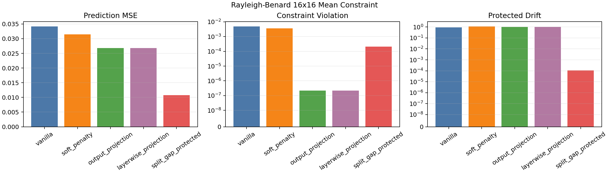
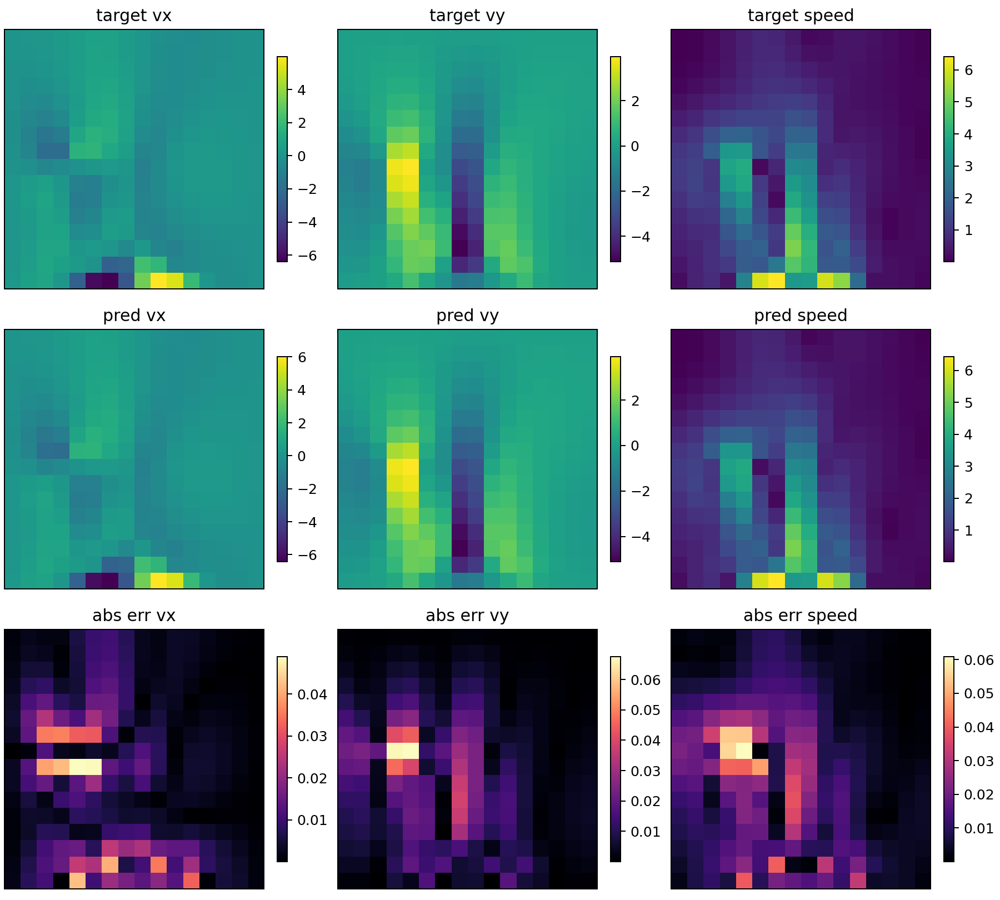
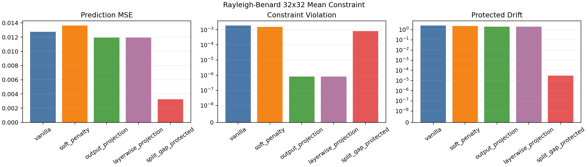
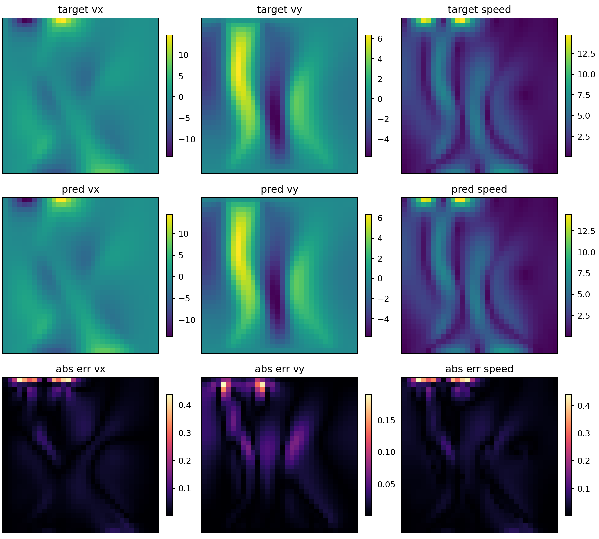
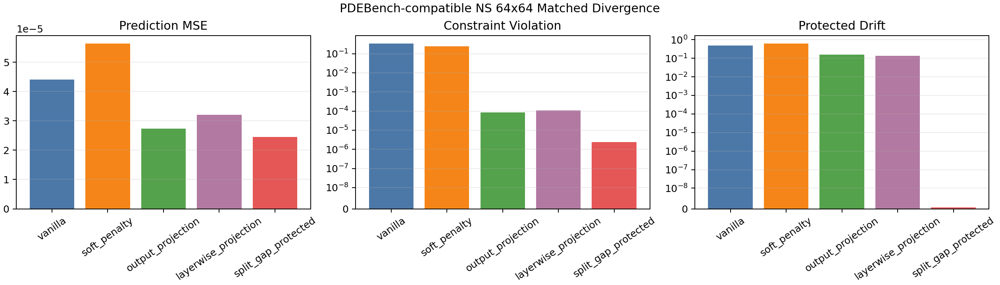
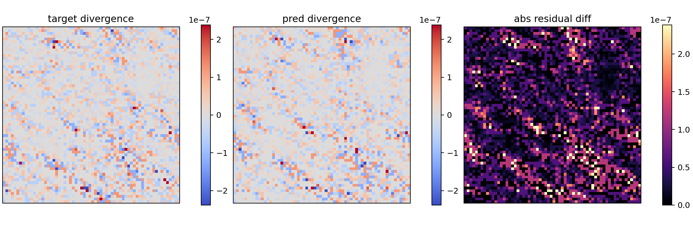

# Gap-Protected Transformers

This repository is a minimal executable scaffold for testing gap-protected neural operators in small PyTorch settings. A known linear constraint `A x = 0` defines the protected subspace `ker A`; models either ignore it, penalize violations, project outputs back to it, or split the state into protected and complement channels. The goal is to test whether Transformer-style learned operators can preserve known protected modes while learning controlled complement dynamics, and whether leakage and gap diagnostics reveal failures that ordinary losses miss.

## Installation

Use Python 3.11 or newer from the repository root.

```bash
python -m pip install torch numpy pytest
```

For editable development:

```bash
python -m pip install -e ".[dev]"
```

For optional HDF5 benchmark files:

```bash
python -m pip install -e ".[dev,benchmark]"
```

For visual benchmark reports:

```bash
python -m pip install -e ".[dev,benchmark,visual]"
```

This installs console scripts:

- `gap-train`
- `gap-evaluate`
- `gap-experiments`
- `gap-validate`
- `gap-make-constraint`
- `gap-benchmark`
- `gap-prepare-rayleigh-benard`
- `gap-prepare-pdebench-ns`
- `gap-visualize`

## Minimal Example

```python
import torch

from gap_protected_transformers import LinearConstraint, ProjectedResidualBlock, MLPCore

A = torch.tensor([[1.0, 1.0, 0.0]], dtype=torch.float64)
constraint = LinearConstraint(A)
block = ProjectedResidualBlock(3, constraint, MLPCore(3, hidden_dim=16)).to(dtype=torch.float64)

x = torch.randn(8, 3, dtype=torch.float64)
y = block(x)
print(constraint.violation(y).max())
```

`ProjectedResidualBlock` applies `P_K(x + core(x))`, so the output is in `ker A` up to numerical precision. For sparse-compatible smoke tests, `ImplicitLinearConstraint` exposes the same projection surface but computes the correction through a conjugate-gradient solve of `A A^* lambda = A x` rather than forming `A^dagger`.

The package now also includes learned compatibility modules:

- `CompatibleRestriction`: learns hierarchy maps constrained by `A_c R = R_A A_f`.
- `CompatibleRouter`: learns expert dispatch matrices constrained to avoid protected/complement cross-mixing.
- `TokenTransformerCore`: a small pre-norm attention plus FFN core over vector chunks.

## Real Data Training

The production path trains on external arrays rather than generated sanity data. Store paired inputs and targets in a `.npz` file and a dense constraint matrix in `.npy` or `.npz`:

```text
data.npz
  x: float array with shape (N, ...)
  y: float array with shape (N, ...)

constraint.npy
  A: float array with shape (constraint_dim, flattened_state_dim)
```

HDF5 files with the same `x` and `y` dataset keys are also supported when the
`benchmark` extra is installed.

Validate data and constraints before training:

```bash
python -m gap_protected_transformers.validate \
  --data fields.npz \
  --constraint constraint_sparse.npz \
  --implicit-constraint \
  --output runs/field_patch_run/validation.json
```

Sparse constraints can be supplied as COO triplets in `.npz` form:

```text
constraint_sparse.npz
  row: int array of nonzero row indices
  col: int array of nonzero column indices
  value: float array of nonzero values
  shape: int array [constraint_dim, flattened_state_dim]
```

Generate a sparse periodic 2D divergence constraint for `(N, 2, H, W)` fields:

```bash
python -m gap_protected_transformers.make_constraint \
  --kind grid-divergence-2d \
  --nx H \
  --ny W \
  --output divergence_constraint.npz
```

Then run:

```bash
python -m gap_protected_transformers.train \
  --data data.npz \
  --constraint constraint.npy \
  --variant split_gap_protected \
  --core transformer \
  --depth 4 \
  --num-tokens 8 \
  --num-heads 1 \
  --epochs 50 \
  --batch-size 32 \
  --output-dir runs/my_real_run
```

Outputs:

- `best.pt` and `last.pt` checkpoints;
- `history.csv` with train/validation loss and diagnostics by epoch;
- `metrics.jsonl` with one JSON metric row per epoch;
- `summary.json` with final metrics and serialized model/training configs.

Use `--variant soft_penalty --penalty-weight <value>` for a loss-only baseline, `--variant output_projection` for final hard projection, `--variant layerwise_projection` for projected residual layers, and `--variant split_gap_protected` for protected/complement transport.

For larger sparse constraints, use iterative projection:

```bash
python -m gap_protected_transformers.train \
  --data data.npz \
  --constraint constraint_sparse.npz \
  --implicit-constraint \
  --variant split_gap_protected \
  --core transformer \
  --output-dir runs/my_sparse_run
```

For field-shaped benchmark arrays such as `(N, C, H, W)`, use the patch Transformer core:

```bash
python -m gap_protected_transformers.train \
  --data fields.npz \
  --constraint constraint_sparse.npz \
  --implicit-constraint \
  --variant split_gap_protected \
  --core patch_transformer \
  --field-shape C,H,W \
  --patch-size 4 \
  --patch-embed-dim 128 \
  --patch-layers 2 \
  --num-heads 4 \
  --output-dir runs/field_patch_run
```

Evaluate a saved checkpoint:

```bash
python -m gap_protected_transformers.evaluate \
  --checkpoint runs/my_real_run/best.pt \
  --data data.npz \
  --constraint constraint.npy \
  --output runs/my_real_run/eval_metrics.json
```

If installed editable, the equivalent commands are:

```bash
gap-train --data data.npz --constraint constraint.npy --output-dir runs/my_real_run
gap-evaluate --checkpoint runs/my_real_run/best.pt --data data.npz --constraint constraint.npy
```

Run a full ablation from a JSON benchmark config:

```json
{
  "data": "fields.npz",
  "constraint": "divergence_constraint.npz",
  "implicit_constraint": true,
  "output_dir": "runs/field_ablation",
  "variants": ["vanilla", "soft_penalty", "output_projection", "layerwise_projection", "split_gap_protected"],
  "model": {
    "core": "patch_transformer",
    "field_shape": [2, 64, 64],
    "patch_size": 4,
    "patch_embed_dim": 128,
    "patch_layers": 2,
    "num_heads": 4,
    "depth": 4
  },
  "training": {
    "epochs": 50,
    "batch_size": 16,
    "lr": 0.001,
    "penalty_weight": 10.0
  }
}
```

```bash
python -m gap_protected_transformers.benchmark --config benchmark.json
```

This writes per-variant train/eval artifacts and `benchmark_summary.csv/json`.

## Real External Benchmark Run

This workspace includes a completed run on the public Hugging Face dataset
`ashiq24/Rayleigh_Benard_Convection` (`data/data_12e3.npz`, MIT license). The
raw file contains 500 frames of `vx`, `vy`, `temp`, and `time` on a 128×128
grid. It was prepared into next-step velocity prediction pairs with shape
`(N, 2, 16, 16)`:

```bash
python -m gap_protected_transformers.prepare_rayleigh_benard \
  --source external_data/rayleigh_benard/data_12e3.npz \
  --output external_data/rayleigh_benard/rb_velocity_16x16_pairs.npz \
  --constraint-output external_data/rayleigh_benard/rb_velocity_16x16_divergence.npz \
  --resolution 16 \
  --max-pairs 160
```

Two real-data ablations were run with `patch_transformer`, depth 1, 2 epochs,
CPU training, and five variants.

Rayleigh-Bénard, 16×16 velocity, sparse divergence diagnostic:

| variant | loss | constraint_violation_mean | protected_drift |
|---|---:|---:|---:|
| vanilla | 0.0266562 | 24.4112 | 0.830074 |
| soft_penalty | 0.116434 | 21.4155 | 1.52105 |
| output_projection | 0.579827 | 3.63984e-05 | 0.838524 |
| layerwise_projection | 0.579827 | 3.63984e-05 | 0.838524 |
| split_gap_protected | 0.0131667 | 24.1635 | 9.69113e-07 |

The downsampled data does not satisfy the simple periodic divergence operator
closely; validation reported target mean divergence residual around `24.25`.
The result is therefore best interpreted as a stress test of projection versus
complement learning, not as a faithful incompressible discretization.

Rayleigh-Bénard, 16×16 velocity, mean-mode protected constraint:

| variant | loss | constraint_violation_mean | protected_drift |
|---|---:|---:|---:|
| vanilla | 0.0341361 | 0.00480409 | 0.93543 |
| soft_penalty | 0.0314471 | 0.00362104 | 1.10544 |
| output_projection | 0.0268377 | 2.16797e-07 | 1.01542 |
| layerwise_projection | 0.0268377 | 2.16797e-07 | 1.01542 |
| split_gap_protected | 0.0107624 | 0.000206385 | 0.000109371 |

This second run uses a constraint that matches the data better: validation
reported target mean residual around `3.56e-4`. In this setting the split model
has the lowest loss and keeps protected drift near zero.

The scaled benchmark uses the same external corpus at 32×32 resolution with 320
next-step pairs, state dimension 2048, a sparse one-row mean-mode constraint,
and six-step rollout diagnostics:

```bash
python -m gap_protected_transformers.prepare_rayleigh_benard \
  --source external_data/rayleigh_benard/data_12e3.npz \
  --output external_data/rayleigh_benard/rb_velocity_32x32_pairs.npz \
  --constraint-output external_data/rayleigh_benard/rb_velocity_32x32_divergence.npz \
  --mean-constraint-output external_data/rayleigh_benard/rb_velocity_32x32_mean_zero.npz \
  --resolution 32 \
  --max-pairs 320

python -m gap_protected_transformers.benchmark \
  --config external_data/rayleigh_benard/rb_32x32_mean_benchmark.json
```

Rayleigh-Bénard, 32×32 velocity, mean-mode protected constraint:

| variant | loss | constraint_violation_mean | protected_drift |
|---|---:|---:|---:|
| vanilla | 0.0127576 | 0.00186304 | 2.51467 |
| soft_penalty | 0.0136253 | 0.00150162 | 2.30146 |
| output_projection | 0.0119372 | 8.05554e-07 | 2.01199 |
| layerwise_projection | 0.0119372 | 8.05554e-07 | 2.01199 |
| split_gap_protected | 0.00324668 | 0.00080193 | 3.04581e-05 |

Validation reported target mean residual around `8.41e-4`. The same prepared
32×32 data also includes a sparse periodic divergence operator with codimension
1024. Its target residual is large (`23.63` mean over the validation sample),
so it remains a scale/stress diagnostic rather than a matched physical
constraint for the downsampled fields.

## Phase 1 Matched Divergence Closeout

Phase 1 is closed by a matched incompressible benchmark using a
PDEBench-compatible Navier-Stokes velocity slice. The preparation command can
ingest official PDEBench HDF5/NPZ velocity output; this workspace uses the
self-contained streamfunction path and records the official PDEBench generator
as provenance rather than claiming a downloaded HDF5 corpus.

```bash
python -m gap_protected_transformers.prepare_pdebench_ns \
  --output external_data/pdebench_ns/ns_incomp_64x64_pairs.npz \
  --constraint-output external_data/pdebench_ns/ns_incomp_64x64_divergence.npz \
  --resolution 64 \
  --pairs 1024 \
  --seed 0

python -m gap_protected_transformers.validate \
  --data external_data/pdebench_ns/ns_incomp_64x64_pairs.npz \
  --constraint external_data/pdebench_ns/ns_incomp_64x64_divergence.npz \
  --implicit-constraint \
  --sample-count 64 \
  --output runs/pdebench_ns_64x64_divergence/validation.json

python -m gap_protected_transformers.benchmark \
  --config external_data/pdebench_ns/ns_64x64_divergence_benchmark.json
```

Validation passed the closeout thresholds with target relative divergence mean
`2.71e-08` and max `2.84e-08`. The five-variant GPU run used 1024 next-step
pairs, 64×64 velocity fields, a centered periodic sparse divergence operator,
20 epochs, and 16-step rollout diagnostics.

| variant | loss | rel. violation mean | protected drift | sigma proxy | train seconds |
|---|---:|---:|---:|---:|---:|
| vanilla | 4.40307e-05 | 0.00374314 | 0.47519 | 0.885643 | 482.99 |
| soft_penalty | 5.63205e-05 | 0.00273254 | 0.610289 | 0.833790 | 461.71 |
| output_projection | 2.73957e-05 | 9.86804e-07 | 0.155765 | 0.0189998 | 1045.27 |
| layerwise_projection | 3.20318e-05 | 1.21459e-06 | 0.135399 | 0.0252155 | 1583.54 |
| split_gap_protected | 2.45167e-05 | 2.69567e-08 | 6.97318e-10 | 0.574806 | 3519.35 |

The hard projection variants enforce divergence near solver tolerance. The
split model preserves the matched divergence at data residual scale and gives
the lowest prediction loss in this run, while taking the most wall time.

## Visual Reports

Benchmark summaries and field-level prediction quicklooks can be generated from
saved artifacts:

```bash
python -m gap_protected_transformers.visualize \
  --summary-csv runs/rayleigh_benard_16x16_mean/benchmark_summary.csv \
  --data external_data/rayleigh_benard/rb_velocity_16x16_pairs.npz \
  --checkpoint runs/rayleigh_benard_16x16_mean/split_gap_protected/best.pt \
  --constraint external_data/rayleigh_benard/rb_velocity_16x16_mean_zero.npz \
  --implicit-constraint \
  --field-shape 2,16,16 \
  --sample-index 159 \
  --output-dir runs/rayleigh_benard_16x16_mean/visuals \
  --title "Rayleigh-Benard 16x16 Mean Constraint"
```

The completed external benchmark report in this workspace includes:

- `runs/rayleigh_benard_16x16_mean/visuals/benchmark_metrics.png`
- `runs/rayleigh_benard_16x16_mean/visuals/component_losses.png`
- `runs/rayleigh_benard_16x16_mean/visuals/field_sample.png`
- `runs/rayleigh_benard_16x16_mean/visuals/prediction_sample.png`
- `runs/rayleigh_benard_32x32_mean/visuals/benchmark_metrics.png`
- `runs/rayleigh_benard_32x32_mean/visuals/component_losses.png`
- `runs/rayleigh_benard_32x32_mean/visuals/field_sample.png`
- `runs/rayleigh_benard_32x32_mean/visuals/prediction_sample.png`
- `runs/pdebench_ns_64x64_divergence/visuals/benchmark_metrics.png`
- `runs/pdebench_ns_64x64_divergence/visuals/component_losses.png`
- `runs/pdebench_ns_64x64_divergence/visuals/field_sample.png`
- `runs/pdebench_ns_64x64_divergence/visuals/prediction_sample.png`
- `runs/pdebench_ns_64x64_divergence/visuals/divergence_residual_sample.png`













## What Is Protected

The protected component is `x_K = P_K x`, where `P_K = I - A^dagger A` is the dense orthogonal projector onto `ker A`. In the first two toys, this means:

- edge-flow graph toy: `A` is a graph incidence matrix, so protected flows are divergence-free edge flows;
- grid divergence toy: `A` is a periodic finite-difference divergence operator, so protected velocity fields have near-zero discrete divergence.

The learned complement is `x_perp = x - x_K`. The split block carries `x_K` through a protected transport path and applies a replaceable MLP, attention, or MoE core to `x_perp`. Complement-dynamics experiments target `x_K + S x_perp`, so exact output projection is expected to discard useful complement information while the split block can keep protected modes and learn a complement map.

## Why This Differs From A PINN

A PINN-style soft penalty adds a loss term such as `||A y||^2` and asks training to reduce violations. A hard projected model prevents selected violations by construction at the projected locations. The split gap-protected block additionally separates protected transport from complement dynamics, so leakage can be audited mode by mode rather than only measured at the final output.

## Ablation Variants

- `vanilla`: residual MLP blocks with no constraint handling.
- `soft_penalty`: same model as `vanilla`, trained with an added `||A y||^2` penalty.
- `output_projection`: vanilla model followed by one final projection onto `ker A`.
- `layerwise_projection`: every residual block applies `P_K(x + core(x))`.
- `split_gap_protected`: protected/complement decomposition at each block; denoising runs use a protected readout, while complement-dynamics runs use residual complement transport plus a learned complement correction.

## Diagnostics

- `constraint_violation`: per-sample `||A x||`.
- `protected_leakage`: probe of `||P_perp T P_K||_F`, measuring protected-to-complement leakage.
- `complement_leakage`: probe of `||P_K T P_perp||_F`, measuring complement-to-protected mixing.
- `commutator_error`: normalized `||A_c R - R_A A_f||_F` for hierarchy compatibility.
- `routing_commutator_error`: normalized `||R P_K - P_K^expert R||_F` for router compatibility.
- `gap_proxy`: smallest positive eigenvalue of `A^* A`, nullity estimate, and gap ratio.
- `jacobian_spectral_proxy`: optional finite-difference estimate of local amplification.
- `rollout_diagnostics`: repeated-application constraint and protected-drift metrics.
- `MatrixFreeLinearConstraint`: apply/adjoint based implicit projection for operators that should not be materialized.

## First Experiment Commands

Run tests:

```bash
pytest -q
```

Run the edge-flow sanity experiment:

```bash
python examples/run_edge_flow_sanity.py
```

Run the grid divergence sanity experiment:

```bash
python examples/run_divergence_free_sanity.py
```

Run the complement-dynamics sanity experiment:

```bash
python examples/run_complement_dynamics_sanity.py
```

Run through the CLI entry point:

```bash
python -m gap_protected_transformers.experiments --experiment edge_flow_sanity
```

Use the tiny attention core instead of the MLP core:

```bash
python -m gap_protected_transformers.experiments --experiment edge_flow_complement --core attention --epochs 60
```

Run nontrivial hierarchy and routing diagnostics:

```bash
python -m gap_protected_transformers.experiments --experiment structure_diagnostics
```

Run learned compatible versus unconstrained hierarchy/routing diagnostics:

```bash
python examples/run_learned_structure_diagnostics.py
```

Metrics are written to `runs/<experiment>/metrics.csv` and `runs/<experiment>/metrics.json`.

## Observed Outputs

On this workspace with Python 3.12.10, PyTorch 2.6.0, and pytest 8.3.5:

```text
pytest -q
44 passed in 7.69s
```

Edge-flow sanity, default settings:

| variant | test_loss | constraint_violation_mean | constraint_violation_max | protected_leakage |
|---|---:|---:|---:|---:|
| vanilla | 0.00576793 | 0.269707 | 0.671901 | 0.767686 |
| soft_penalty | 0.0187155 | 0.347557 | 0.625801 | 0.929008 |
| output_projection | 0.000319048 | 1.38876e-15 | 3.31955e-15 | 1.27597e-15 |
| layerwise_projection | 0.00011671 | 8.81399e-16 | 2.31289e-15 | 3.62167e-16 |
| split_gap_protected | 2.09563e-31 | 8.24852e-16 | 2.42222e-15 | 8.61793e-17 |

Grid divergence sanity, default settings:

| variant | test_loss | constraint_violation_mean | constraint_violation_max | protected_leakage |
|---|---:|---:|---:|---:|
| vanilla | 0.0176068 | 1.40608 | 2.16595 | 4.49731 |
| soft_penalty | 0.0434412 | 1.36994 | 2.01107 | 3.92038 |
| output_projection | 0.00150667 | 2.29843e-15 | 3.26807e-15 | 3.2703e-15 |
| layerwise_projection | 0.00164948 | 1.79296e-15 | 2.82923e-15 | 2.38187e-15 |
| split_gap_protected | 2.79773e-31 | 1.58416e-15 | 2.58366e-15 | 6.36009e-16 |

Edge-flow complement dynamics, MLP core, 80 epochs:

| variant | test_loss | protected_component_loss | complement_component_loss | protected_leakage |
|---|---:|---:|---:|---:|
| vanilla | 0.00685534 | 0.000355029 | 0.00650031 | 0.89465 |
| soft_penalty | 0.0698862 | 0.00608282 | 0.0638033 | 0.927296 |
| output_projection | 0.06476 | 0.000110541 | 0.0646495 | 1.30445e-15 |
| layerwise_projection | 0.06472 | 7.05261e-05 | 0.0646495 | 3.61363e-16 |
| split_gap_protected | 0.00367197 | 5.35071e-33 | 0.00367197 | 5.64488e-12 |

Structure diagnostics:

| diagnostic | value |
|---|---:|
| compatible cycle hierarchy commutator | 0 |
| incompatible cycle hierarchy commutator | 0.414214 |
| componentwise router commutator | 0 |
| random router commutator | 0.609369 |

Learned structure diagnostics:

| variant | fit_loss | commutator |
|---|---:|---:|
| hard compatible restriction | 0.046875 | 5.20417e-17 |
| soft-penalty restriction | 0.0720119 | 0.0772431 |
| unconstrained restriction | 1.28466e-06 | 0.413441 |
| hard compatible router | 0.0374654 | 1.34361e-15 |
| soft-penalty router | 0.113465 | 0.00241911 |
| unconstrained router | 0.000513643 | 0.618472 |

Complement-dynamics rollout diagnostics, MLP core, 80 epochs:

| variant | rollout_violation_final | protected_relative_drift | complement_sigma_proxy |
|---|---:|---:|---:|
| vanilla | 1.28216 | 0.275046 | 1.0951 |
| soft_penalty | 0.594558 | 0.689906 | 0.909542 |
| output_projection | 1.26569e-15 | 0.244048 | 2.53056e-12 |
| layerwise_projection | 9.75222e-16 | 0.0498794 | 2.73317e-12 |
| split_gap_protected | 1.1876 | 8.95027e-16 | 1.05821 |

These are sanity checks, not evidence of broad model superiority. The useful early signal is that soft penalties can leave measurable leakage in short toy runs, exact projection can enforce protected outputs while discarding complement targets, and split protected transport can preserve the protected component while learning a small complement map. The learned structure diagnostic shows the expected tradeoff: unconstrained maps can fit an incompatible target closely while violating compatibility; compatible parameterizations keep commutators near numerical zero; soft penalties occupy the middle but do not provide exact guarantees. The rollout table adds a second distinction: split protection can allow complement constraint residuals while keeping protected-component drift essentially zero.

## Claim Boundary

This repository does not claim to invent Hodge decompositions, divergence-free neural networks, hard-constrained neural operators, hard-constrained PINNs, neural multigrid, or Transformer preconditioners. The contribution being scaffolded is the Transformer/MoE-native synthesis: protected-mode transport, learned complement dynamics, compatible hierarchy and routing maps, and diagnostics for leakage and gap preservation.

## Current Limitations

- `ImplicitLinearConstraint` and `MatrixFreeLinearConstraint` provide CG projection scaffolds, not tuned multigrid/AMG Hodge solvers.
- The attention and MoE cores are intentionally tiny placeholders.
- `TokenTransformerCore` and `PatchTransformerCore` are benchmark-ready baselines, but not yet optimized production architectures.
- The matched Phase 1 closeout uses a self-contained PDEBench-compatible streamfunction slice; use `--source` with official PDEBench HDF5 output to reproduce against a downloaded PhiFlow simulation artifact.
- The real-data runs are short next-step prediction benchmarks with rollout diagnostics, not long-horizon PDE rollout training.
- Learned hierarchy and routing diagnostics are matrix-level toys; learned compatible transfer in a real multiresolution model remains future work.
